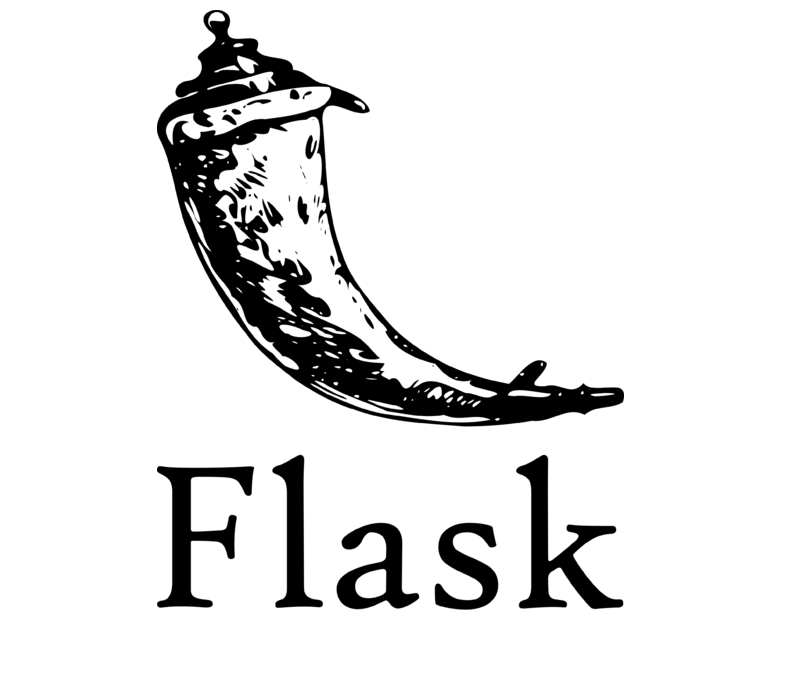
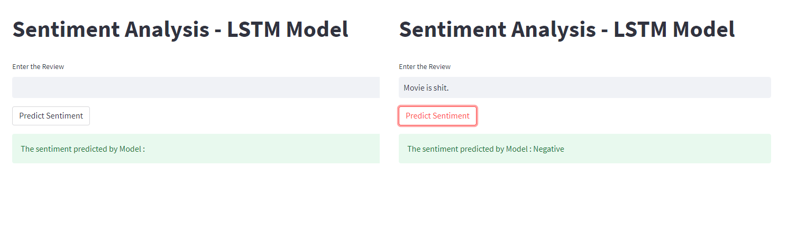

# Hello!<a href=""></a>

My name is **Miguel Ferreira** and I'm a *web developer* and *data scientist* from Brazil, especialized in CRISP-DM data science methodology and predictive Machine Learning for time series.

I hold the **IBM Data Scientist certificate** (*Coursera*) and several others professional certificates from *Udemy*, *Unimed* (network of hospitals) and *Digital Innovation One* (online tech profissionalization network) in different tech areas as **Data Science, Machine Learning, Databases**, **MERN web development** and **Java Web Development**. I'm proficient in tasks that envolves:    

  - **CRISP-DM Data Science Methodology** 📊
  - **Python frameworks for web development** 📋
  - **Java frameworks for web development** 📑
  - **Version control** :octocat:
  - **Deploy and hosting** 🍻
  - **Java OOP** 👾

My most important tool is my capability to *link different fields of knowledge on approaching the problem to be solved*.

When I'm not being a computer nerd, I like reading old books (the older the better), playing chess, swimming, drawing and studying and working on new good but impracticable ideas.


<div align="center"><p><i>Pic I took</i></p></div>

You can check my curriculum [here](https://github.com/miguelrferreiraf/certificates/blob/main/Data_Scientist_Developer(en-original).pdf).

Check all my certificates [here](https://github.com/miguelrferreiraf/certificates).

Below, you can find some of my projects:

# IBM Capstone Space-X Data Science Final Project
  
>*"In this Professional Certificate, learners developed and honed handson skills in Data Science and Machine Learning. Learners started with an orientation of Data Science and its Methodology, became familiar and used a variety of data science tools, learned Python and SQL, performed Data Visualization and Analysis, and created Machine Learning models. In the process they completed several labs and assignments on the cloud including a Capstone Project at the end to apply and demonstrate their knowledge and skills."*

<div align="left"></div>

In this project, a full data science methodology is displayed in order to provide an insight about the launch of a rocket by Space-X. The purpose of this project is to establish data based information about the costs and the success rate of a lauch in order to realize if it is or if it isn't an affordable mission. 

Check full project [here](https://github.com/miguelrferreiraf/IBM_CAPSTONE_SpaceX-Data-Science_final-project).

# LSTM/RNN fo Movie Review Predictor with Flask

<div align="center"></div>

In this small project using Flask, I deploy a Machine Learning LSTM Neural Networks to create a algorithm that can understand a movie critic and define if it's a good or bad review. The usage is very simples, as seen below.

<div align="center"></div>

Check out the code [here](https://github.com/miguelrferreiraf/LSTM_RNN_movie-review-predictor).

# Header 3

```js
// Javascript code with syntax highlighting.
var fun = function lang(l) {
  dateformat.i18n = require('./lang/' + l)
  return true;
}
```

```ruby
# Ruby code with syntax highlighting
GitHubPages::Dependencies.gems.each do |gem, version|
  s.add_dependency(gem, "= #{version}")
end
```

#### Header 4

*   This is an unordered list following a header.
*   This is an unordered list following a header.
*   This is an unordered list following a header.

##### Header 5

1.  This is an ordered list following a header.
2.  This is an ordered list following a header.
3.  This is an ordered list following a header.

###### Header 6

| head1        | head two          | three |
|:-------------|:------------------|:------|
| ok           | good swedish fish | nice  |
| out of stock | good and plenty   | nice  |
| ok           | good `oreos`      | hmm   |
| ok           | good `zoute` drop | yumm  |

### There's a horizontal rule below this.

* * *

### Here is an unordered list:

*   Item foo
*   Item bar
*   Item baz
*   Item zip

### And an ordered list:

1.  Item one
1.  Item two
1.  Item three
1.  Item four

### And a nested list:

- level 1 item
  - level 2 item
  - level 2 item
    - level 3 item
    - level 3 item
- level 1 item
  - level 2 item
  - level 2 item
  - level 2 item
- level 1 item
  - level 2 item
  - level 2 item
- level 1 item

### Small image


### Large image


### Definition lists can be used with HTML syntax.

<dl>
<dt>Name</dt>
<dd>Godzilla</dd>
<dt>Born</dt>
<dd>1952</dd>
<dt>Birthplace</dt>
<dd>Japan</dd>
<dt>Color</dt>
<dd>Green</dd>
</dl>

```
Long, single-line code blocks should not wrap. They should horizontally scroll if they are too long. This line should be long enough to demonstrate this.
```

```
The final element.
```
